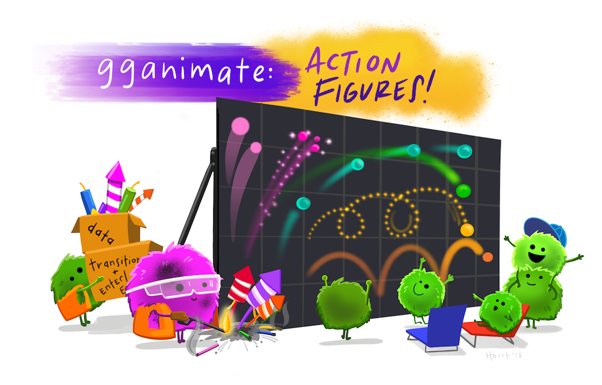

# Animated graphics: intro to ggplot2 with gganimate
eco-data-sci workshop (January 2019)

[eco-data-sci.github.io](eco-data-sci.github.io)

In this eco-data-sci session, we'll use simple examples to refresh ggplot2 skills, learn some basics of gganimate with ggplot2, and explore a few useful gg-extras. 



Included:

- Animated point plots
- Animated line plots
- Animated column graphs- Animated ridge plots (ggplot2 + ggridges + gganimate)
- Easing + tweening options (ease_aes and enter/exit)
- 4 transition types: transition_states, transition_layers, transition_manual, transition_reveal
- Repulsive text labels (geom_text_repel)


## Required packages: 

- ggplot2
- ggridges 
- gganimate
- ggrepel

Install gganimate development versions from github:

```r
# install.packages('devtools')
devtools::install_github('thomasp85/gganimate')
```

## Data: 

### Channel Island Fox population data (ci_fox_pop.csv)

Friends of the Channel Island Fox: <http://www1.islandfox.org/p/materials.html>

### Star Wars API ('starwars' in dplyr)

This data comes from SWAPI, the Star Wars API (<http://swapi.co/>), and exists in dplyr as 'starwars'. 
More information: <https://dplyr.tidyverse.org/reference/starwars.html>

### Abalone physiology and rings data (abalone.csv): 

Accessed from UCI Machine Learning Repository (<https://archive.ics.uci.edu/ml/datasets/abalone>)

Warwick J Nash, Tracy L Sellers, Simon R Talbot, Andrew J Cawthorn and Wes B Ford (1994), "The Population Biology of Abalone (_Haliotis_ species) in Tasmania. I. Blacklip Abalone (_H. rubra_) from the North Coast and Islands of Bass Strait", Sea Fisheries Division, Technical Report No. 48 (ISSN 1034-3288)

Original Owners of Database:
Marine Resources Division
Marine Research Laboratories - Taroona
Department of Primary Industry and Fisheries, Tasmania

